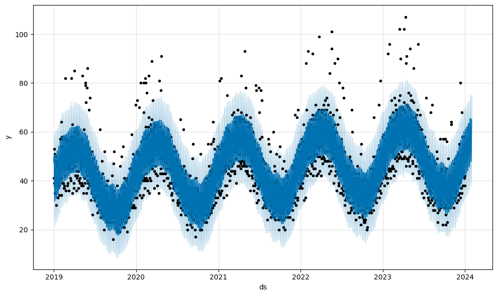
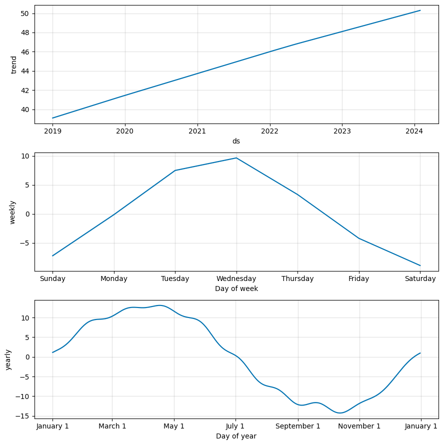
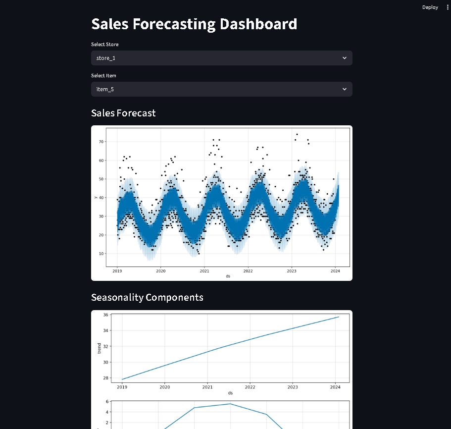

## Sales Forecasting Using Time Series

### Project Overview

This project predicts future product sales using historical retail sales data.
The goal is to help businesses estimate future demand and plan inventory more efficiently.

The project uses time-series forecasting techniques to analyze trends, seasonality, and demand patterns.

- The model captures trend, weekly seasonality and yearly seasonality to improve forecasting accuracy.

---

### Dataset

The dataset contains retail transaction information including:

* Date
* Store ID
* Item ID
* Sales
* Price
* Promotion indicator
* Weekday
* Month

The dataset includes:

* **50 stores**
* **Multiple products**
* **5 years of daily sales data**

## Dataset

Due to GitHub file size limitations, the dataset is not included in this repository.

---

### Project Workflow

####  Data Preparation

* Load dataset using Pandas
* Convert date column to datetime
* Sort data chronologically

####  Exploratory Data Analysis

* Checked missing values
* Analyzed sales distribution
* Visualized sales trends over time
* Detected seasonal patterns

####  Stationarity Testing

Performed Augmented Dickey-Fuller (ADF) test to determine if the time series is stationary.

####  Baseline Forecasting Model

Implemented ARIMA model to establish a baseline forecasting performance.

####  Advanced Forecasting Model

Used Prophet model to capture:

* Trend
* Weekly seasonality
* Yearly seasonality

####  Product-Level Forecasting

Instead of forecasting total sales, the project predicts sales for a **specific store-item combination**.

####  Future Sales Prediction

The model forecasts sales for the **next 30 days**.

---

### Dashboard

An interactive dashboard was built using Streamlit where users can:

* Select store
* Select item
* Generate sales forecast
* Visualize seasonal demand patterns

## Dashboard Preview

### Forecast Plot

### Seasonality Plot

### Streamlit Dashboard

---

### Technologies Used

* Python
* Pandas
* NumPy
* Matplotlib
* Seaborn
* Statsmodels
* Prophet
* Streamlit

---

### Project Structure

sales-forecasting-project
│
├── data
│   └── train.csv
│
├── notebooks
│   └── sales_forecasting_analysis.ipynb
│
├── app
│   └── streamlit_app.py
│
├── outputs
│   └── future_30_day_sales_forecast.csv
│
├── requirements.txt
└── README.md

---

### Example Forecast Output

| Date       | Predicted Sales |
| ---------- | --------------- |
| 2024-01-01 | 42              |
| 2024-01-02 | 45              |
| 2024-01-03 | 44              |

---

### Business Insights

* Sales show clear seasonal demand patterns.
* Weekly variations indicate different shopping behavior across weekdays.
* The forecasting model can help businesses optimize stock planning and avoid inventory shortages.

---

### Future Improvements

* Add holiday effects to improve forecast accuracy
* Deploy dashboard to cloud
* Add price and promotion impact analysis

